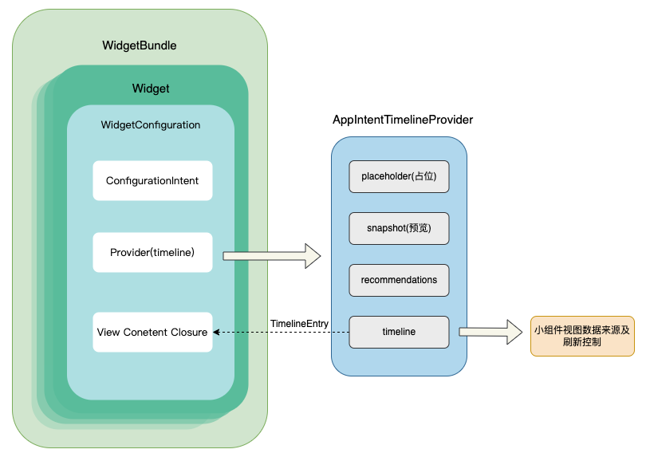
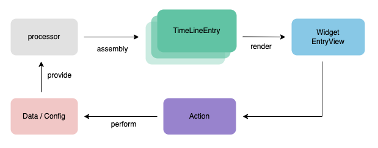
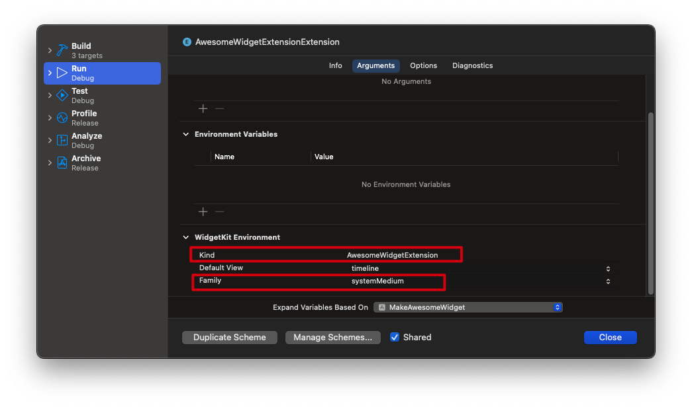

# Widget 桌面小组件


文档需要在实践的基础上理解 建议先创建一个Demo尝试后理解
[项目地址 MakeAweSomeWidget](https://github.com/wfs777/MakeAweSomeWidget)

目前仅包含桌面小组件，关于灵动岛及liveActivity的开发后续再进行补充。

## 整体概述

### 基础概念

小组件从 App 提取及时且与个人相关的少量信息，将其显示在用户一眼就能看到的地方，并在不启动 App 的情况下提供特定的 App 功能。在 iPhone 和 iPad 上，用户可以将小组件放在今天视图、主屏幕和锁定屏幕。在 Mac 上，用户可以将原生 Mac App 小组件放在桌面和通知中心。从 iOS 17 和 macOS 14 开始，用户还可以将 iPhone 小组件放在 Mac 桌面和通知中心。在 Apple Watch 上，小组件显示在智能叠放中。

> 注释
> visionOS 不会载入兼容的 iPad 和 iPhone App 中的 WidgetKit 扩展。

本文目前仅介绍桌面小组件，其他涉及灵动岛、Live Activity、小组件等后续若有开发需求将进行补充。
### 交互和小组件设计

小组件的开发**必须使用SwiftUI**框架，这是苹果第一次强制要求使用特定UI框架开发系统功能。同时依赖的核心框架是WidgetKit，用于处理小组件的生命周期、数据更新和系统交互。

#### iOS14与iOS17核心差异对比

| 特性     | iOS14             | iOS17                                        |
| -------- | ----------------- | -------------------------------------------- |
| 交互能力 | 点击只能打开主App | 支持Button和Toggle的直接交互                 |
| 配置方式 | 静态配置          | 支持AppIntent动态配置                        |
| 实时性   | 依赖时间线刷新    | 也无法保持实时更新，但触发时间线的方式有增加 |
| 设计限制 | 严格限制交互元素  | 允许有限但更有意义的交互                     |
| 使用场景 | 信息展示为主      | 可完成简单功能操作                           |

iOS17之前仅可以通过URL或者Link的方式进入APP来响应小组件的点击交互操作。
iOS17之后可以通过Button和Toggle两个控件传入APPIntent来响应用户的交互事件。可以采用ToggleStyle来控制组件样式

### 关键协议理解



#### WidgetBundle
- **核心作用**：允许多个小组件在单个扩展中聚合
- **重要特性**：
    - 使用`@main`标记作为入口点
    - 必须实现`var body: some Widget { get }`
    - 典型实现包含多个`Widget`的集合

#### Widget

`Widget` 协议是 iOS 小组件开发中最核心的协议，它定义了小组件的入口和基本配置。

```swift
public protocol Widget {
    // 小组件的唯一标识符
    var kind: String { get }
    
    // 小组件的配置和内容
    @WidgetConfigurationBuilder var body: some WidgetConfiguration { get }
}
```

##### kind 属性

- **作用**：唯一标识你的小组件
- **要求**：
    - 必须是字符串常量
    - 在同一个 App 中必须唯一
    - 建议使用反向域名格式（如 "com.yourcompany.weatherwidget"）

##### body 属性

- **作用**：定义小组件的配置和内容
- **返回类型**：必须符合 `WidgetConfiguration` 协议

#### Configuration

在iOS 17中，小组件的配置方式进一步扩展，新增了 **`AppIntentConfiguration`**，与原有配置类型的对比：

1. **StaticConfiguration**
    - **适用场景**：完全静态的小组件，无需用户自定义参数。
    - 示例：仅显示固定数据的视图。
2. **IntentConfiguration**
    - **适用场景**：通过Siri快捷指令（Shortcuts）让用户动态配置参数（如待办事项的筛选条件）。
    - 依赖 `INIntent` 框架，需用户手动设置参数。


3. **AppIntentConfiguration（iOS 17新增）**
    - **核心改进**：直接集成 `AppIntent` 协议，无需依赖Siri快捷指令，开发者可自定义逻辑和参数。
    - **优势**：
        - 支持更灵活的交互逻辑（如链式调用多个Intent）。
        - 可注册到系统搜索服务，用户无需手动添加即可调用。
	- **参数解释**
		 1. `kind: String`
			- **作用**：小组件的唯一标识符
			- **要求**：
			    - 必须与 Info.plist 中 `NSExtension.NSExtensionAttributes.WKWidgetKind` 一致
			    - 推荐使用反向域名格式（如 `"com.example.NotesWidget"`）
			- **注意**：同一 App 内不能重复
		 2. `intent: Intent.Type`
			- **作用**：指定关联的 AppIntent 类型
			- **约束**：
			    - 必须符合 `AppIntent` 协议
			    - 泛型参数 `Intent` 需与 `Provider` 的关联类型一致
		 3. `provider: @escaping () -> Provider`
			- **作用**：创建数据提供者的工厂闭包
			- **关键点**：
			    - 返回的实例需符合 `AppIntentTimelineProvider`
			    - 系统会缓存该实例，通常无需自行管理生命周期
		4. `content: @escaping (Provider.Entry) -> Content`
			- **作用**：视图构建闭包
			- **参数**：
			    - 接收 `Provider` 生成的 `Entry` 数据
			    - 需返回符合 `View` 协议的 SwiftUI 视图

```swift
extension AppIntentConfiguration {

    /// Creates a configuration for a widget by using a custom intent
    /// to provide user-configurable options.
    /// - Parameters:
    ///   - kind: A unique string that you choose.
    ///   - intent: A custom intent containing user-editable
    ///     parameters.
    ///   - provider: An object that determines the timing of updates
    ///     to the widget's views.
    ///   - content: A view that renders the widget.
    @MainActor @preconcurrency public init<Provider>(kind: String, intent: Intent.Type = Intent.self, provider: Provider, @ViewBuilder content: @escaping (Provider.Entry) -> Content) where Intent == Provider.Intent, Provider : AppIntentTimelineProvider
}
```

| 类型                       | 引入版本 | 核心用途                             | 数据驱动方式          | 交互能力   |
| -------------------------- | -------- | ------------------------------------ | --------------------- | ---------- |
| **StaticConfiguration**    | iOS 14   | 完全静态内容                         | 手动更新              | 仅深层链接 |
| **IntentConfiguration**    | iOS 14   | 可配置的动态内容（基于旧版 SiriKit） | `INIntent` + 用户配置 | 有限配置   |
| **AppIntentConfiguration** | iOS 17   | 支持交互的动态内容                   | `AppIntent`           | 交互支持   |

#### Intent

1. **INIntent**(对此不再进行详细介绍)
	- 让第三方应用集成到 Siri 和快捷指令(Shortcuts)中
	- 定义应用可以执行的特定操作
	- 允许系统和其他应用向你的应用发送意图请求
	- 需要创建单独的 Intent Definition 文件
	- 协议：
		- **INIntent**: 基础意图类
		- **INIntentHandling**: 处理意图的协议
		- **INExtension**: 处理Siri和快捷指令请求的扩展


2. **AppIntent**（iOS17+） [WWDC2023](https://developer.apple.com/videos/play/wwdc2023/10103)
    - 交互式操作的抽象表示
    - 支持异步操作执行
    - 必须实现`perform()`方法
    - 典型用途：按钮点击、开关切换等交互行为的逻辑封装
    - 注意使用参数化协议 使用 `@Parameter`

```swift
public protocol AppIntent: PersistentlyIdentifiable, _SupportsAppDependencies, Sendable {
    // 小组件需要
    // MARK: - 必需属性
    /// 意图的显示名称（动词+名词，标题式大写）
    /// 示例：LocalizedStringResource("创建笔记")
    static var title: LocalizedStringResource { get }
    /// 意图的详细描述（显示在配置界面）
    static var description: IntentDescription? { get }
    /// 参数摘要的动态配置（描述参数组合逻辑）
    /// 示例：Summary("按\(\.$category)筛选")
    static var parameterSummary: Self.SummaryContent { get }
    
    // MARK: - 必需方法
    /// 意图执行逻辑（核心业务处理）
    func perform() async throws -> Self.PerformResult
    
    /// 必须实现的空初始化器
    init()

    // ELSE 非必需
    // MARK: - 核心关联类型
    /// 定义意图执行结果的返回类型（必须符合IntentResult）
    associatedtype PerformResult: IntentResult
    
    /// 参数摘要的关联类型（自动推断自parameterSummary实现）
    associatedtype SummaryContent: ParameterSummary
    
    // MARK: - 重要可选属性
    /// 是否在执行时打开宿主App（默认false）
    static var openAppWhenRun: Bool { get }
    
    /// 身份验证策略（默认.unrequired）
    /// 可选值：.unrequired / .requiresAuthentication
    static var authenticationPolicy: IntentAuthenticationPolicy { get }
    
    /// 是否允许系统发现此意图（默认true）
    /// 关闭后将无法通过快捷指令/搜索触发
    static var isDiscoverable: Bool { get }

}
```

 Tip: WidgetConfigurationIntent也是AppIntent 不过perform的返回永远为never 作为配置项使用

#### Provider

AppIntentTimelineProvider &&  IntentTimelineProvider

1. **IntentTimelineProvider**（可配置组件）：
```swift
protocol IntentTimelineProvider {
    associatedtype Intent: WidgetConfigurationIntent
    func placeholder(in: Context) -> Entry
    func getSnapshot(for: Intent, in: Context, completion: @escaping (Entry) -> Void)
    func getTimeline(for: Intent, in: Context, completion: @escaping (Timeline<Entry>) -> Void)
}
```

- 核心责任：将用户配置(Intent)转换为数据时间线
- 必须处理配置参数的动态变化

2. **AppIntentTimelineProvider**（iOS17交互式组件）：
```swift
public protocol AppIntentTimelineProvider<Intent, Entry> where Intent: AppIntent, Entry: TimelineEntry {
    associatedtype Intent
    associatedtype Entry
    
    // 必须实现的方法
    func placeholder(in context: Context) -> Entry
    func snapshot(for configuration: Intent, in context: Context) async -> Entry
    func timeline(for configuration: Intent, in context: Context) async -> Timeline<Entry>
    
    // 可选实现的方法
    func recommendations() -> [IntentRecommendation<Intent>]
}
```

- 在基础时间线功能上增加：
    - 交互事件与时间线的关联管理
    - 动态响应`AppIntent`触发的更新
- 额外要求：
- 处理`RelevanceUpdate`事件
- 协调后台刷新与用户交互的优先级

#### Entry && EntryView
1. **Entry**：
    - 数据的时空快照
    - 必须包含`date`字段（用于时间线管理）
    - 建议遵循`Equatable`协议优化刷新逻辑
    - 典型包含三个数据维度：
        - 时间维度（自动管理）
        - 配置参数（来自Intent）
        - 业务数据（来自App）
2. **EntryView**：
    - SwiftUI视图的特定实现
    - 遵循Widget特有的布局约束：
        - 不支持交互视图（除iOS17+的特定控件）
        - 自动适配各尺寸变体（通过`widgetFamily`）
        - 禁止使用耗性能的动画


### 总结


## 小组件的配置


关于配置项建议优先参考代码
#### iOS16+

iOS16之后官方支持了 @Parameter来创建小组件的可配置选项
只需要在`WidgetConfigurationIntent`创建参数即刻增加配置

```swift
@Parameter(
        title: "功能项",
        description: "选择并排序要显示的功能",
        requestValueDialog: .init("选择并排序要显示的功能"),
        optionsProvider: SortableItemOptionsProvider()
    )
    var items: [SortableItem]?
```

参数类型决定了配置的样式，也可以通过optionsProvider进行部分自定义。
同时可以在`parameterSummary`根据条件来展示隐藏某些配置项。

```swift
    static var parameterSummary: some ParameterSummary {
        When(\.$showTitle, .equalTo, true) {
            Summary {
                \.$carControls
                \.$items
                \.$province
                \.$city
                \.$background
                \.$showTitle
                \.$title
                \.$refreshInterval
            }
        } otherwise: {
            Summary {
                \.$carControls
                \.$items
                \.$province
                \.$city
                \.$background
                \.$showTitle
                \.$refreshInterval
            }
        }
    }
```

如果两个配置项存在关联关系，也可以在`EntityStringQuery`控制，如选择省份后再选择城市，可参考如下代码
```swift
struct CityOption: AppEntity, Hashable {
    let id: String
    let name: String
    let province: String
    
    static var typeDisplayRepresentation: TypeDisplayRepresentation = "城市"
    static var defaultQuery = CityOptionQuery()
    
    var displayRepresentation: DisplayRepresentation {
        DisplayRepresentation(
            title: LocalizedStringResource(stringLiteral: "\(name)")
        )
    }
}

struct CityOptionQuery: EntityStringQuery {
    
    @IntentParameterDependency<SortableWidgetConfigIntent>(
        \.$province
    )
    var configIntent
    
    func entities(matching string: String) async throws -> [CityOption] {
        CityOption.allCities.filter { string.contains($0.id) }
    }
    
    func entities(for identifiers: [String]) async throws -> [CityOption] {
        CityOption.allCities.filter { identifiers.contains($0.id) }
    }

    func suggestedEntities() async throws -> [CityOption] {
        guard let configIntent else { return [] }
        return CityOption.allCities.filter { $0.province == configIntent.province.name }
    }
    
}
```


#### iOS14 - iOS15

需要通过创建`intentdefinition`做为意图文件，在里面配置对应的内容来配置小组件
可以参考[iOS小组件开发全面总结](https://juejin.cn/post/7408931981848068096)的小组件配置章节，此块代码也增加在了代码库中囊括。


## 交互&&数据流

iOS17和iOS14提供的时间线提供者协议

### 小组件数据流及刷新


以下是一个用于显示角色生命值等级的游戏小组件的示例。当生命值等级低于 100% 时，角色会以每小时 25% 的速率进行恢复。例如，当角色的生命值等级为 25% 时，需要 3 个小时才能完全恢复到 100%。下图显示了 WidgetKit 如何从提供程序请求时间线，从而在时间线条目中指定的每个时间呈现小组件。


上述是官方提供的小组件时序图，可以查看[让小组件保持最新状态](https://developer.apple.com/cn/documentation/widgetkit/keeping-a-widget-up-to-date/)这篇文档来理解。


小组件的核心数据刷新方法为下面的timeline方法：

```swift
func timeline(for configuration: Self.Intent, in context: Self.Context) async -> Timeline<Self.Entry>
```


#### 三种刷新机制

1. 小组件自动刷新时间线
	- 通过设置`ReloadPolicy`让小组件自己执行timeline方法来刷新，但是不能保证精准的时间间隔
2. 用户点击小组件交互
3. APP主动触发小组件刷新

**上述任何一次触发刷新都是走进timeline方法，然后返回未来时间点的小组件需要显示的状态交给EntryView来展示。**

每个活跃时间段不能超过28s，例如`timeline`返回结果必须在28s以内完成，否则刷新超时。

#### [点击交互的刷新问题](https://developer.apple.com/forums/thread/767189)
目前发现AppIntent接收的点击事件去刷新时间线，会出现刷新两次的问题。此问题在iOS18.4已经得以解决，但表现在目前的小组件上，可能存在问题。

理解小组件的刷新是一种单向数据流，小组件根据传入的 Timeline\<Entry\>来展示。


### 小组件与主工程通信

| 方式                           | 支持方向        | 适用场景                    |
| ------------------------------ | --------------- | --------------------------- |
| App Group + UserDefaults       | 双向            | 主 App 修改数据，Widget读取 |
| App Group + FileManager        | 双向            | 图片、JSON 等复杂文件共享   |
| App Group + CoreData           | 双向            | 复杂结构数据、数据库        |
| WidgetCenter.reloadAllTimeline | 主 App → Widget | 主动触发 Widget 刷新        |
| Deeplink / URL Scheme          | Widget → App    | 用户点击跳转 App 具体页面   |
| AppIntent (iOS 16+)            | Widget → App    | Widget 内按钮或开关触发动作 |


## 相关关键开发问题

### 关于调试


- Kind 作为唯一标识可以指定调试的小组件
- Family指定调试的Widget的大小
### 关于请求问题

1. 必须使用 async/await（Swift Concurrency模型）
2. 不能脱离 TimelineProvider /Intent的生命周期
	- 网络请求必须**在 timeline(for:in:)或者AppIntent的perform() 的调用生命周期里完成**。
	- 不能启动一个异步任务然后自己放着，TimelineProvider就结束了，结果还没回来。
	- 否则，小组件框架认为你超时了，直接丢弃你的请求（不会等你）。
3. **不能手动开 Task {}** 去异步执行，必须直接 `await` 等待结果。
4. 小组件内不支持弹窗/提示/授权交互

### 关于定位问题

iOS14 可以通过闭包回调的方式却获取定位

| API调用位置                         | 能否获取定位   | 备注                                            |
| ----------------------------------- | -------------- | ----------------------------------------------- |
| getTimeline(completion:) (iOS14-15) | ✅ 有机会获取   | 系统调度，成功率不保证                          |
| timeline(for:in:) (iOS16+)          | ❌ 几乎无法获取 | 环境限制，定位请求直接失败                      |
| AppIntent.perform() 点击触发        | ❌ 无法定位     | 无权限，只能同步操作                            |
| 从 App 同步到 Widget                | ✅ 可行         | App内先拿定位，存储到共享容器，再供 Widget 读取 |

### 编译问题

问题本质

1. **语言隔离性**
    - 小组件（Widget Extension）默认使用Swift编写，而主工程若以Objective-C为主，混合编译时容易出现符号（Symbol）无法解析的问题。
    - 即使通过`Bridging Header`桥接，部分OC库可能因模块化配置（如未正确定义`@import`或`#import`）或依赖链断裂导致编译失败。
2. **动态库/静态库限制**
    - 小组件与主工程属于不同的二进制目标（Target），若基础库（如网络请求库）未明确支持动态链接（`Dynamic Framework`）或未正确配置`Embed & Sign`，会导致运行时加载失败。
3. **封装库的兼容性问题**
    - 若网络请求库封装时依赖了主工程的OC代码（如全局宏、Category扩展等），而小组件无法访问主工程的编译上下文，会直接报错“Undefined symbol”。


## 参考文档
[WidgetKit](https://developer.apple.com/cn/documentation/widgetkit/)
[网易iOS小组件开发指南](https://juejin.cn/post/6887759096506744840?searchId=202507071103409DA0340325F1A8506428)
[iOS小组件开发全面总结](https://juejin.cn/post/7408931981848068096)